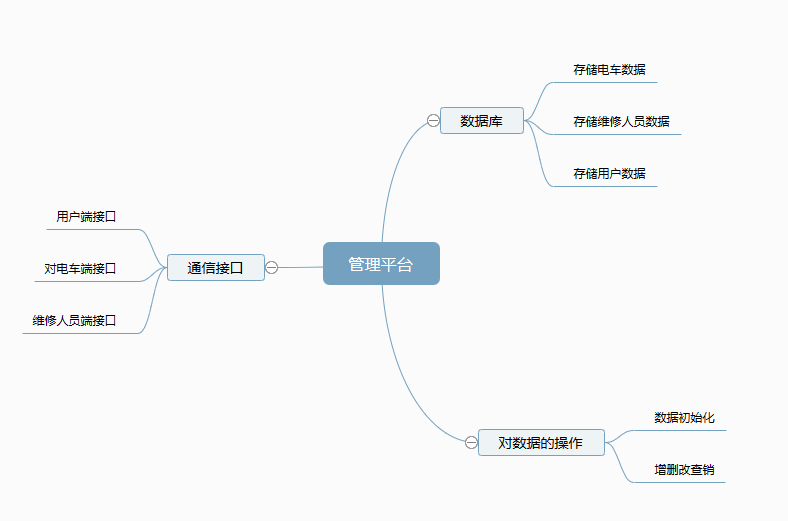
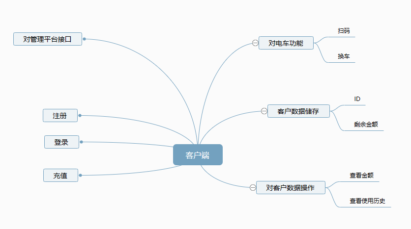
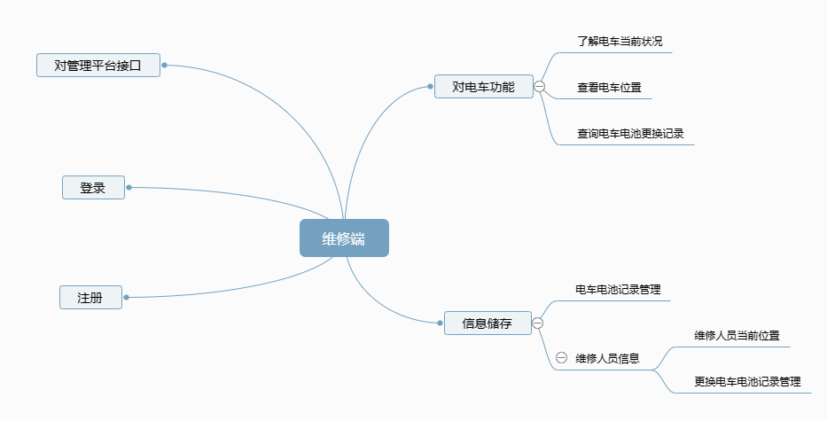

# 需求分析
## 大致需求分析
该项目主要开发三个用户端以及搭建一个云服务器平台
+ 电动车端：主要实现对电动车的定位(Locate),启停控制(Start Stop Control),计时(Timing),电池记录(Battery Record)
+ 客户端：提供用户使用，主要实现扫码用车(Scanning)，换车(Change Bike)，报修(Report)，用户使用记录管理(User Usage Record Management)
+ 维修人员端：提供维修人员使用,主要实现维护人员对共享电动车状态的了解。了解电动车电池情况(Understand battery condition),查找电动车位置(Locate)，更换电池记录管理(Battery Record Manage)
+ 管理平台：采用MQTT协议。对数据进行存储管理。需要电车数据的初始化(initialization Of bike),车辆位置的识别(Locate)，车辆使用时间记录(Time record)，收费金额计算(Count),记录查询(Record Manage)并对其他三个端提供接口。
## 管理平台

## 电车端

电车端只存储少量信息，其余信息存储到云端数据库
## 客户端

## 维修人员端
